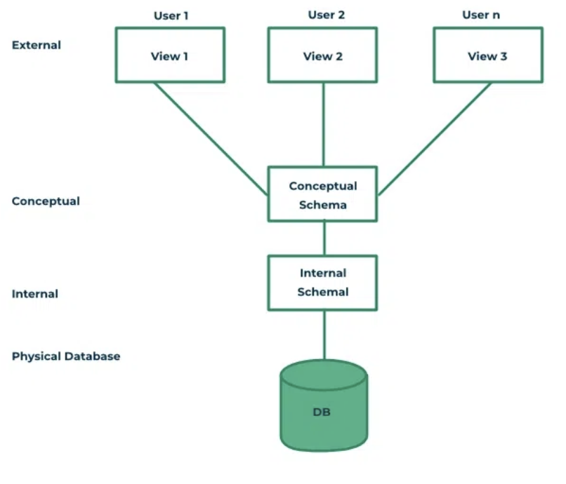

## Schema가 무엇인가요?
- data model을 바탕으로 db 구조를 기술한 것 
- db를 설계할 때 정해진다. 

### Schema의 3계층에 대해 설명해 주세요.

- User application으로 부터 물리적인 DB를 분리시키는 목적
- 각 계층마다 schema가 정의되어 있음
- 각 계층이 독립적이기 때문에 어느 계층의 변화가 상위 계층에 영향을 주지 않기 위해 존재

#### Internal Schema
- 물리적으로 데이터가 어떻게 저장되는지
- physical data model을 통해 표현
- data storage, data structure, access path 실체가 있는 내용 기술

#### External Schema
- user views라고도 불림
- 특정 유저가 필요로 하는 데이터 표현
- 그 외 알려줄 필요가 없는 데이터는 숨김

#### Conceptual Schema 
- 전체 DB에 대한 구조 기술
- 물리적인 저장 구조에 관한 내용 숨김
- entities, data types, relationship, user operations, constraints 에 집중
- logical data model를 통해서 기술
